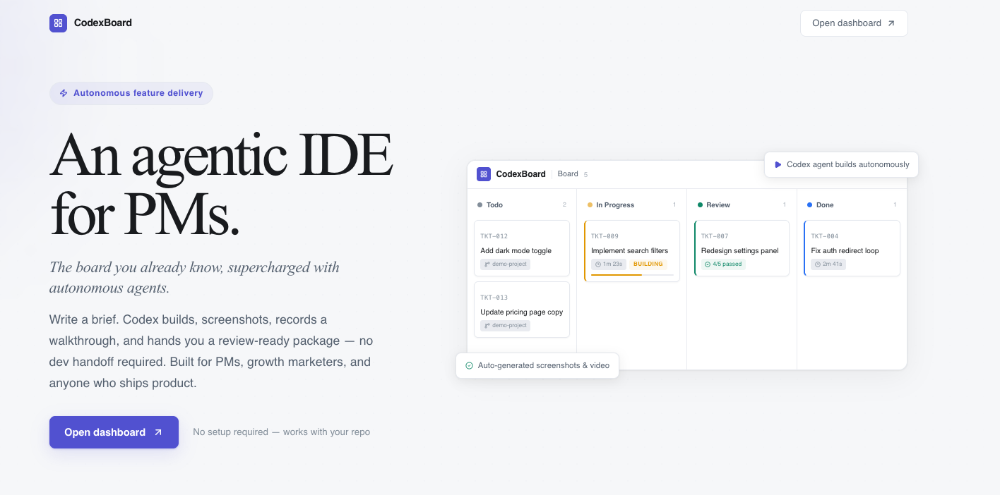
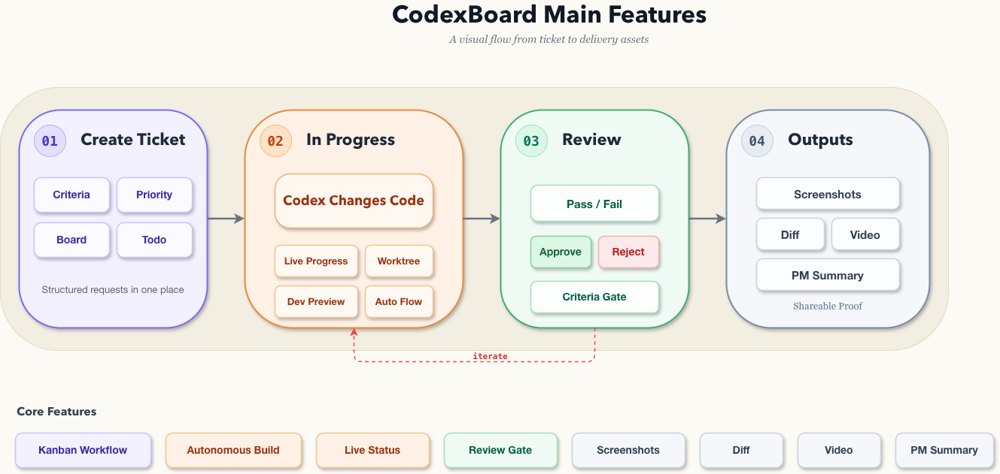
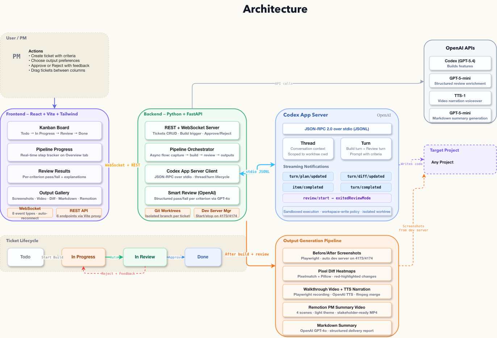

# CodexBoard



CodexBoard is a Kanban-style workspace for PMs, marketers, growth hackers, and operators who want to ship ideas faster.

It lets non-engineering teams create tickets, define success, track progress, review outcomes, and collect assets in one familiar flow, while Codex handles the implementation behind the scenes.

It combines:

- a board for organizing and tracking work
- an automated build and review flow
- progress updates while work is running
- generated outputs like screenshots, video, and summaries
- a PM-friendly demo video workflow

## Visual Overview

### Main Features



### Architecture



## What It Does

CodexBoard is designed around a simple flow:

1. Create a ticket with acceptance criteria.
2. Send it to `In Progress`, where Codex works on the request.
3. Review the result against the original criteria.
4. Generate delivery assets such as screenshots, diff views, video, and markdown summaries.

For the end user, the experience feels much closer to using a project board than using a coding tool:

- PMs can describe a feature and review it against clear acceptance criteria
- marketers can request landing-page or messaging changes and get visual outputs back
- growth teams can iterate on experiments with visible progress and proof of what changed
- non-engineering stakeholders can stay inside a workflow they already understand

Core product capabilities:

- Kanban-style ticket workflow
- criteria-based ticket creation
- autonomous build execution
- live progress updates
- review pass/fail results per criterion
- before/after screenshots
- pixel diff output
- walkthrough and PM summary video generation
- markdown delivery summaries

## Repo Layout

- [`frontend/`](/Users/divyansh/Desktop/Divyansh/Development/Hackathons/CodexHack/CodexBoard/frontend) - React + Vite board UI
- [`backend/`](/Users/divyansh/Desktop/Divyansh/Development/Hackathons/CodexHack/CodexBoard/backend) - FastAPI API, pipeline, state, worktree, and output orchestration
- [`remotion/`](/Users/divyansh/Desktop/Divyansh/Development/Hackathons/CodexHack/CodexBoard/remotion) - Remotion composition for summary/demo video rendering
- [`docs/architecture.drawio`](/Users/divyansh/Desktop/Divyansh/Development/Hackathons/CodexHack/CodexBoard/docs/architecture.drawio) - architecture diagram
- [`docs/main-features.drawio`](/Users/divyansh/Desktop/Divyansh/Development/Hackathons/CodexHack/CodexBoard/docs/main-features.drawio) - product/features diagram

## Local Setup

### Frontend

```bash
cd frontend
npm install
```

### Backend

Always use the backend virtual environment.

```bash
cd backend
python -m venv .venv
source .venv/bin/activate
python -m pip install --upgrade pip
python -m pip install -r requirements.txt
```

### Remotion

```bash
cd remotion
npm install
```

## Run The App

Start the backend first:

```bash
cd backend
source .venv/bin/activate
python -m uvicorn main:app --reload --port 8000
```

In a second terminal, start the frontend:

```bash
cd frontend
npm run dev
```

Optional: run the Remotion studio in a third terminal:

```bash
cd remotion
npm run studio
```

App endpoints:

- frontend: `http://localhost:5173`
- backend API: `http://localhost:8000`
- frontend preview build: `http://localhost:4173`

## How The Stack Fits Together

- The frontend creates tickets, shows board state, streams pipeline progress, and displays outputs.
- The backend exposes `/api/tickets`, `/ws`, approval/rejection actions, and output file serving.
- The pipeline moves tickets from `Todo` to `In Progress` to `Review` to `Done`.
- The backend can trigger Codex work, parse review results, manage worktrees, and collect output assets.
- Remotion is used for polished stakeholder-facing summary video output.

## Important Dev Notes

- The frontend proxies API and WebSocket traffic to the backend during development.
- If the backend is not running, the frontend may still render using fallback/mock behavior, but it will not be connected to the real API.
- Python dependencies for this repo should be installed in `backend/.venv`, not globally.

## Verification

Frontend:

```bash
cd frontend
npm test
npm run build
```

Backend:

```bash
cd backend
source .venv/bin/activate
pytest
```

Remotion:

```bash
cd remotion
npm run render
```

## Related Docs

- [`backend/README.md`](/Users/divyansh/Desktop/Divyansh/Development/Hackathons/CodexHack/CodexBoard/backend/README.md)
- [`frontend/README.md`](/Users/divyansh/Desktop/Divyansh/Development/Hackathons/CodexHack/CodexBoard/frontend/README.md)
- [`docs/architecture.drawio`](/Users/divyansh/Desktop/Divyansh/Development/Hackathons/CodexHack/CodexBoard/docs/architecture.drawio)
- [`docs/main-features.drawio`](/Users/divyansh/Desktop/Divyansh/Development/Hackathons/CodexHack/CodexBoard/docs/main-features.drawio)
